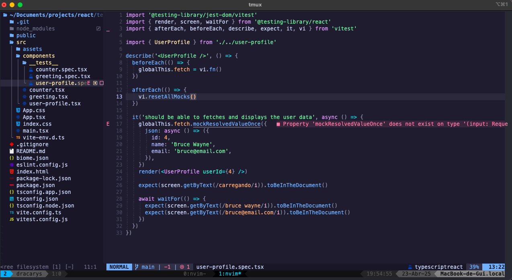
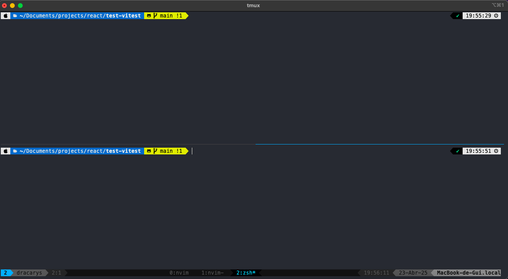

# My Dotfiles

<p>Algumas configurações que eu uso no meu setup</p>

<p align="center">
  
  
</p>


## Neovim

## Instale as dependências

Bash

```
sudo port install ripgrep

```

Bash

```
npm install -g @biomejs/biome
```


## ZSHRC
